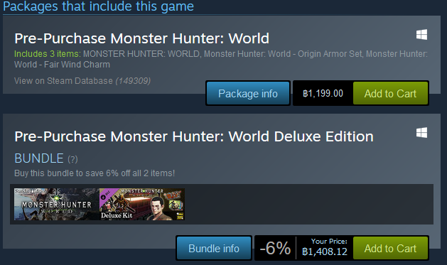
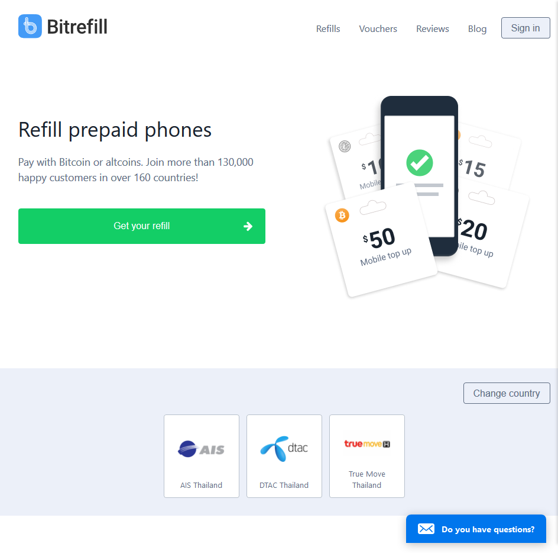
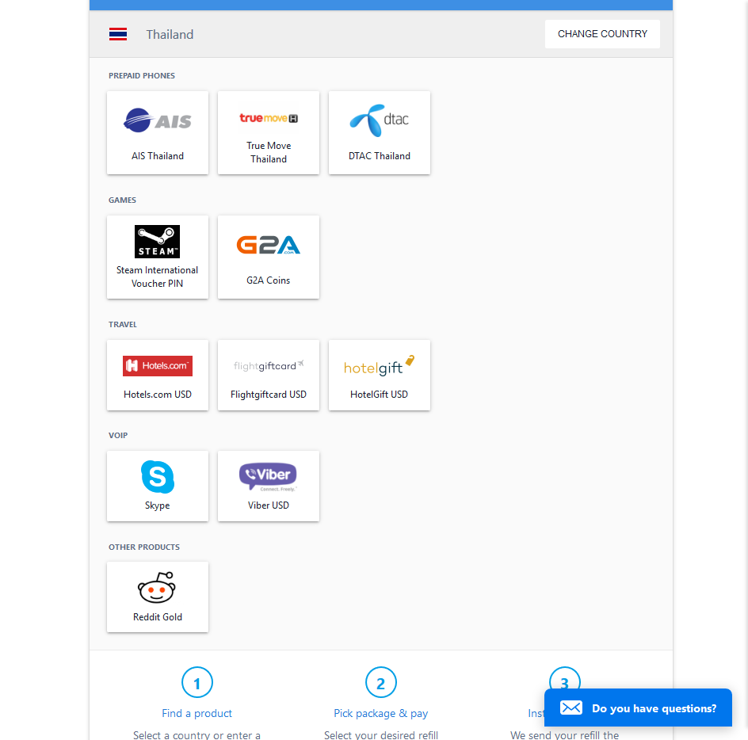
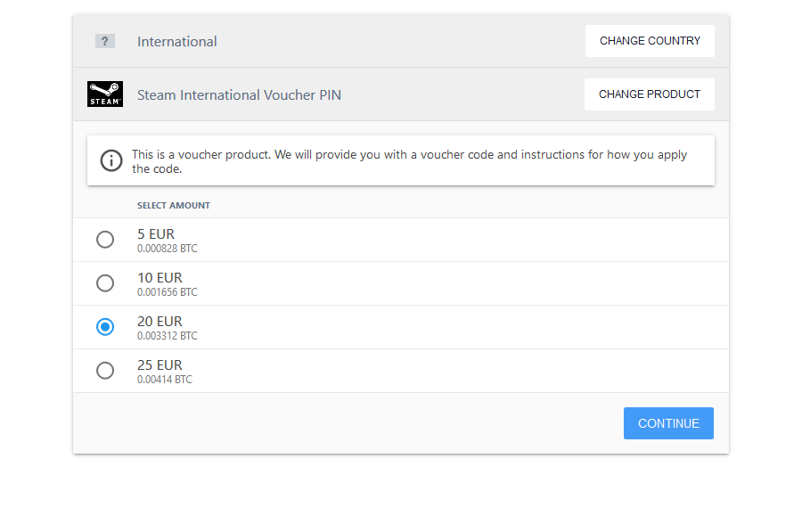
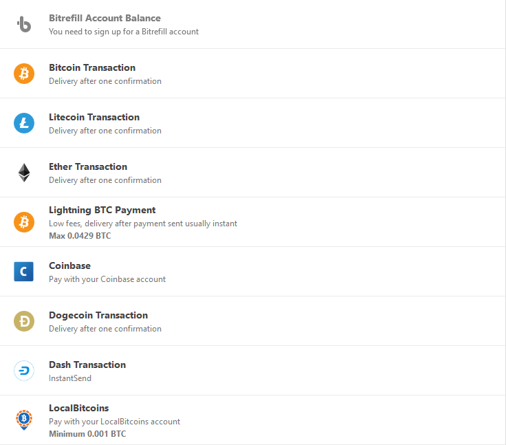

ก่อนอื่นต้องบอกก่อนเลยว่าทาง Steam เคยรับ Bitcoin เอง แต่ตอนนี้ได้ยกเลิกไปแล้วเนื่องจากความผันผวนของราคาและเรื่อง Transaction Fee ที่เด้งสูงจนทำให้เกิดความปั่นป่วนในการซื้อเกมขึ้นจนเป็นเหตุให้ยกเลิกไป
แล้วตอนนี้จะทำอย่างไรล่ะ ถ้าเรามีเหรียญคริปโตติดกระเป๋าแล้วอยากซื้อเกมฟรีๆล่ะ

อันนี้ถือว่าเป็นปัญหาแรกที่เกิดขึ้นมาใหม่ๆ เพราะ [Monster Hunter: World](https://store.steampowered.com/app/582010/MONSTER_HUNTER_WORLD/) ดันมาเข้า PC ตอนที่กำลังจะเปิดเทอมน่ะสิ เงินค่าเทอมนี่สั่นกันเลยทีเดียว

แน่นอนว่าค่าเทอมต้องล็อกไว้หลังบ้านแน่นๆ แล้วเอาเงินในบัญชีมาโปะแทน…
เอ้า ไม่ได้อีก ไม่งั้นจะไม่มีอะไรกินไปครึ่งเดือนเลยนะ

ด้วยความที่ไปซนกับวงการคริปโตซะตั้งแต่ Bitcoin ราคา $10 ยัน $10,000 ก็คงจะไม่แปลกที่จะมีติดกระเป๋าบ้าง แน่นอนว่าเราสามารถนำมันมาทำประโยชน์กับเราได้
จึงทำให้เกิดแรงกระตุ้นในการหาวิธีแปลงคริปโต ให้กลายเป็นเงินใน Steam ให้ได้

ไม่นานหลังจากนั้น ก็ได้พบกับเว็บต่างประเทศที่ขายบัตรเติมเงิน Steam ด้วยคริปโต
นามว่า [Bitrefill](https://blog.bitrefill.com/@bitrefill) โดยเว็บนี้ นอกจากขายบัตร Steam แล้วก็ยังมีบริการอื่นๆ อีกด้วย

แน่นอนว่าจุดประสงค์หลักนั้นคือการซื้อบัตรเติม Steam โดยใช้คริปโต เว็บนี้เขาจะขายบัตรแบบเดียวคือ International EURO แต่ Steam จะแปลงหน่วยเงินเป็นบาทให้

เมื่อคลิกมาแล้วก็สามารถเลือกราคาได้ตามที่เขามีให้ สต็อกอาจจะเปลี่ย  นแปลงได้

หลังจากนั้นก็สามารถเลือกช่องทางจ่ายเงินได้ เพราะเว็บนี้ไม่ได้รับแค่ Bitcoin อย่างเดียว เขารับทั้ง Litecoin, Ethereum, Dogecoin, Dash รวมไปถึง Bitcoin ผ่าน Lighting network, Coinbase และ LocalBitcoin อีกด้วย

หลังจ่ายเงินแล้วนั้น ใช้เวลารอไม่นานมากถ้าโชคดีตรง network เป็นใจ แล้วเดี๋ยวทางเว็บก็จะส่งโค้ดเติมเงินมาให้ทั้งผ่านอีเมลและหน้าเว็บ สำหรับบางเหรียญอาจมีติดเรื่อง network confirm บ้าง เขาก็จะส่งอีเมลมาบอกสถานะเรื่อยๆ

### ทิ้งท้าย

ถือว่าสมัยนี้ตัว Bitcoin นั้นเป็นสิ่งที่หลายๆคนรู้จักว่ามันเป็นเงินแห่งอินเตอร์เน็ต แต่หลายๆคนมักไม่สนใจว่ามันสามารถเอามาใช้ในชีวิตประจำวันได้เหมือนเงินสด
ในบทความนี้ก็เป็นหนึ่งในการใช้งาน Bitcoin ตามจุดประสงค์ของมันอย่างหนึ่ง ที่ว่าจะเป็นเงินสำหรับทุกคน ใช้ได้ทั่วโลก และให้ทุกคนเป็นธนาคารของตัวเอง
