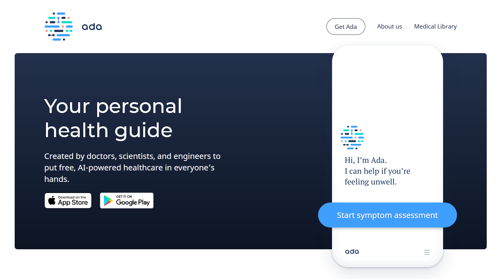
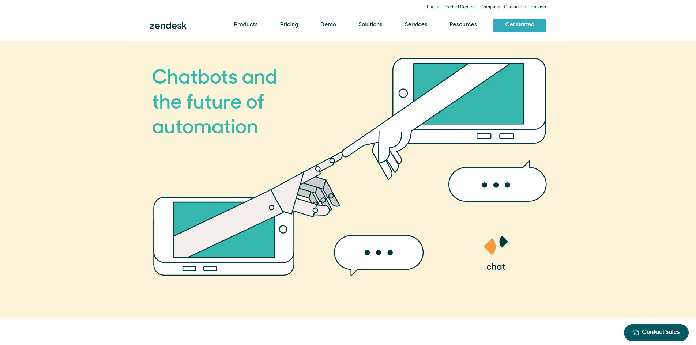
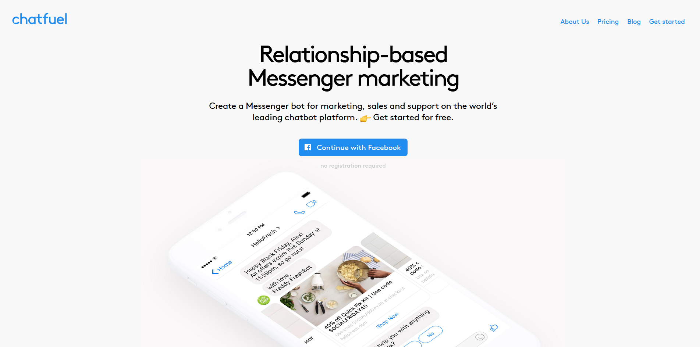

ในยุคสมัยที่สมาร์ทโฟนของหลายๆคนเต็มไปด้วยแอพแชทต่างๆมากมาย มันต้องมีบ้างแหละที่เราบังเอิญกดไปเจอกับพวก chatbot เข้า จะคนตอบก็ไม่ใช่ ถามอะไรก็ตอบได้เกือบหมด สรุปว่า chatbot มันคืออะไรกันแน่ ทำไมสมัยนี้เห็นใช้กันเยอะจัง

**Chatbot** (แชทบอท) คือโปรแกรมที่ถูกเขียนขึ้นมาเพื่อใช้ในการโต้ตอบกับผู้ใช้ โดยมีจุดประสงค์ที่ต่างกันไปขึ้นอยู่กับผู้ที่เขียนแชทบอทขึ้นมา บางที่ใช้ในการช่วยรับคำสั่งซื้อสินค้าจากลูกค้า โดยให้แชทบอทรับข้อมูลเบื้องต้นแล้วค่อยส่งต่อให้กับพนักงานหลังจากจบการคุยเบื้องต้น หรือบางที่นำแชทบอทมาช่วยในการรักษาอาการเบื้องต้นเวลาไม่สบาย รวมถึงตระกูล virtual assistant ทั้งหลายเช่น Google Assistant, Siri, Alexa, Bixby และอื่นๆอีกมากมาย ซึ่งปัจจุบันนั้นพบได้บนเว็บ แอพบนสมาร์ทโฟน และอุปกรณ์ smart home ยอดนิยม

Chatbot ในปัจจุบันนั้นจะเห็นได้อยู่สองประเภทหลักๆ คือ แบบที่ตอบตามกฏที่เขียนไว้ (rules-based) ซึ่งส่วนใหญ่เวลาตอบกลับจะตอบมาแบบที่อๆ ตามที่คนสร้างได้เขียนกฏเอาไว้ กับแบบที่ใช้ Artifitial Inteligence มาช่วยตอบ ซึ่งจะมีความสามารถในการอ่านแล้วเข้าใจและเรียนรู้ได้เอง แต่ละแบบก็มีจุดเด่นจุดด้อยตามกันไปแต่ละแบบการใช้งาน

โดยแอพแชทยอดนิยมส่วนใหญ่ก็จะมีการรองรับการสร้าง chatbot ขึ้นมา โดยแต่ละที่จะมีความสามารถที่ต่างกันบ้าง ขึ้นอยู่กับผู้ให้บริการว่าจะสร้างโครงแบบไหนให้ใช้กัน ส่วนผู้ที่จะสร้าง chatbot นั้นก็สามารถหา documents สำหรับการทำ chatbot ของแต่ละ platform ได้ทันที

ยิ่งในสมัยนี้มีบริการทำ chatbot แบบแทบไม่ต้องแตะโค้ด ชนิดที่เรียกว่าจับวางๆเดี๋ยวก็เสร็จ งอกขึ้นมากันมากมาย โดยเฉพาะ Facebook ที่มีตัวสร้างการโต้ตอบเบื้องต้นให้ใช้ได้ทุกเพจ จึงเป็นเหตุว่าทำไมในช่วงนี้จะเห็นบริษัทหรือร้านค้าต่างๆนำ chatbot มาใช้ช่วยให้การแบ่งเบาภาระผู้ดูแลและใช้เป็นอีกช่องทางในการเข้าถึงลูกค้าได้

## สุดท้ายนี้

Chatbot นั้นคือสิ่งที่ถูกสร้างขึ้นมาเพื่อเป็นอีกหนึ่งอุปกรณ์ที่จะอยู่กับเราเช่นเดียวกับสมาร์ทโฟน เพราะความสะดวกและประโยชน์อันมากล้นของมัน จึงทำให้มันกลายเป็นสิ่งที่ทุกคนต้องพบเจอและอยู่กับมันไปอีกนาน หวังว่าในอนาคต chatbot จะไม่ครองโลกไปหมดซะก่อนนะ
