DigitalOcean คือผู้ให้บริการ Cloud server ระดับต้นๆ โดยถูกออกแบบมาเพื่อให้ Developer ใช้งานได้อย่างสะดวกและง่ายดาย ด้วยจุดเด่นในด้านความเร็วในการตั้งเซิร์ฟเวอร์เพียงไม่กี่อึดใจและราคาที่เหมาจ่ายเป็นรายชั่วโมง

## บริการต่างๆ

### Droplets

> [https://www.digitalocean.com/products/compute/](https://www.digitalocean.com/products/compute/)

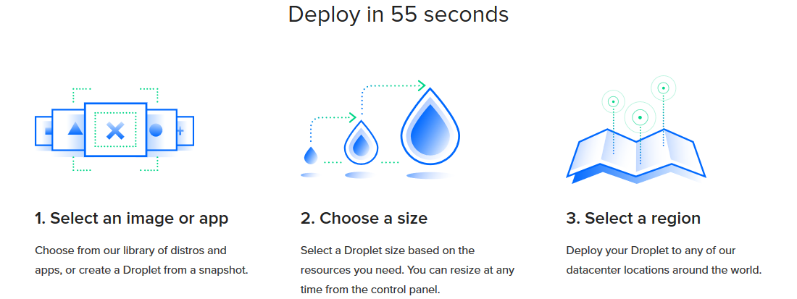

Droplets นั้นคือเซิร์ฟเวอร์เสมือนที่สามารถ Deploy ได้ภายในเวลาไม่ถึงนาที โดยมีตัวเลือกให้ค่อนข้างละเอียดในเรื่องของ RAM, CPU และขนาดของ SSD โดยสามารถเปลี่ยนสเปคได้ตามการใช้งานที่แตกต่างกันไป โดยมีให้เลือกหลากหลายแบบ ทั้งแบบทั่วไป และแบบเน้น CPU หรือเน้น RAM

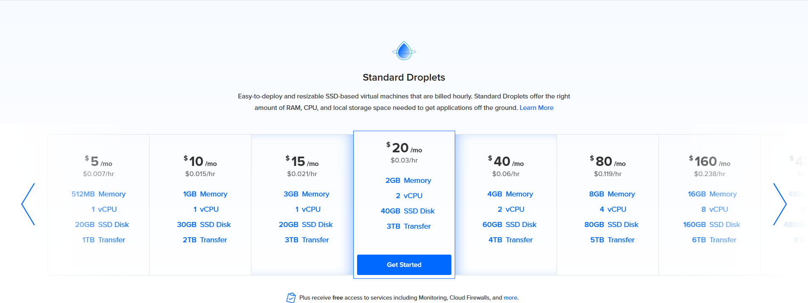

โดย OS ที่สามารถใช้ได้นั้นจะเป็น Linux distro ทั้งหลาย เช่น Ubuntu, Debian และ CentOS จึงทำให้มีความยืดหยุ่นในการลงซอฟท์แวร์อย่างมาก

นอกจากนี้แล้วยังมีชุดซอฟท์แวร์พร้อมใช้ที่เรียกว่า One-click apps พร้อมให้ลงและใช้ได้ทันที เช่น WordPress, Docker และ MEAN

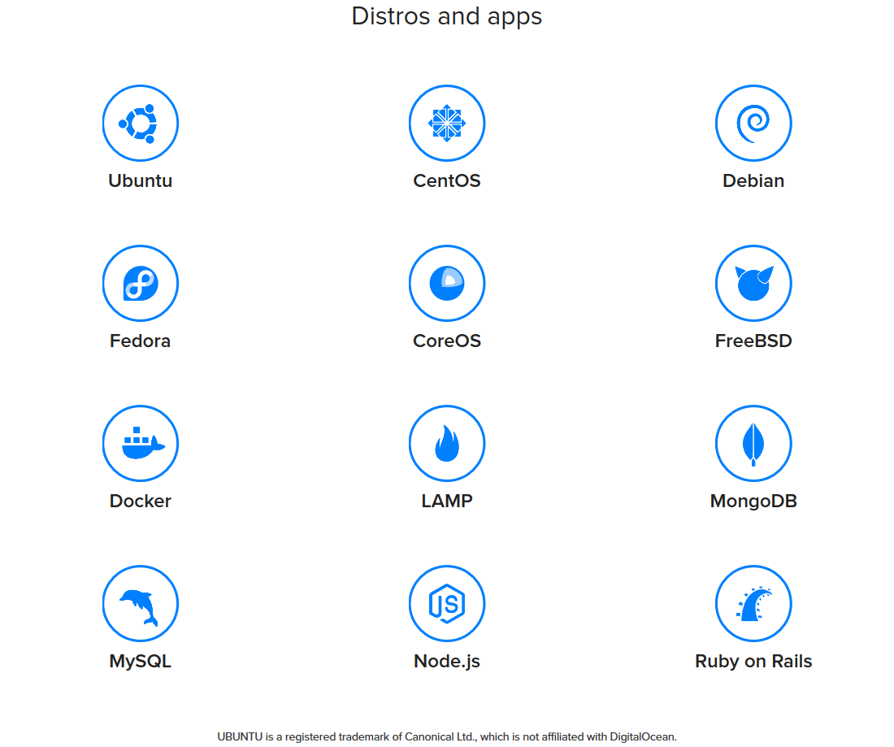

ในเมื่อเป็นผู้ให้บริการ Cloud server นั้น ต้องมีพื้นที่ให้เช่าในหลายโซนประเทศให้มากที่สุด โดย DigitalOcean นั้นมีเซิร์ฟเวอร์ตั้งอยู่ทุกทวีป รวมถึงโซนเอเชียด้วย

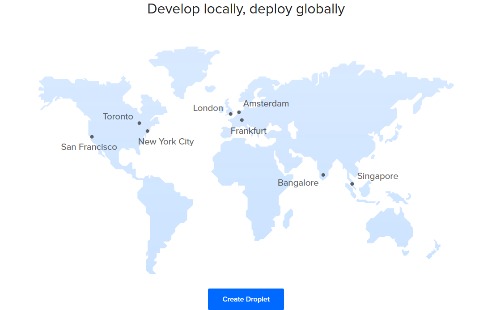

หากทรัพยากรที่เราเลือกไปตอนแรกนั้นไม่พอ หรือต้องการเพิ่มประสิทธิภาพของ Droplet เราสามารถกดซื้อเพิ่มได้ทันที โดยข้อมูลต่างๆจะยังคงอยู่ที่เดิม หรือถ้าหากต้องการพื้นที่ Storage มากขึ้นอีก ก็สามารถซื้อเพิ่มได้เช่นกัน

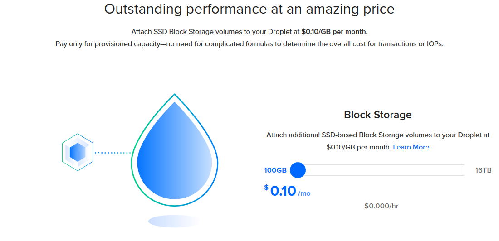

หรือถ้าต้องการความจุแบบเต็มอิ่ม ใช้สำหรับงานใหญ่ๆหรือเก็บไฟล์เยอะๆ ทาง DigitalOcean ก็มีบริการใหม่ ชื่อว่า…

### Spaces

> [https://www.digitalocean.com/products/object-storage/](https://www.digitalocean.com/products/object-storage/)

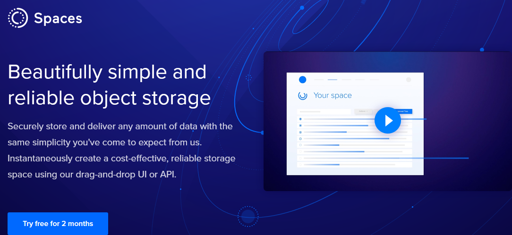

Spaces นั้นเป็นบริการใหม่ของทาง DigitalOcean ที่สามารถใช้เป็นคลังเก็บไฟล์ขนาดใหญ่กว้างขวางในราคาที่จับต้องได้ โดยจะแตกต่างตรงที่ Spaces นั้นเราจะได้มาเพียงโกดังขนาดใหญ่ เทียบกับ Droplets ที่เหมือนห้องเช่าที่มีอุปกรณ์เครื่องใช้

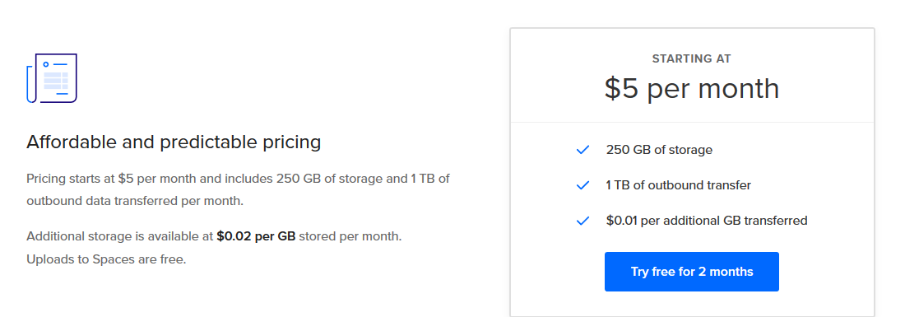

จุดประสงค์หลักของ Spaces นั้นคือการทำ Storage ให้กับแอพลิเคชั่นของเราที่ต้องการพื้นที่ในการเก็บข้อมูลสูง เช่นเก็บรูปภาพ ไฟล์ล็อก หรือคอนเทนต์ต่างๆบนเว็บได้โดยไม่ต้องกลัวว่าพื้นที่ใน Droplet จะเต็ม เพราะหากใช้เกินทางระบบจะคิดเพิ่มให้อัตโนมัติ และข้อดีอีกอย่างก็คือการที่ไม่จำเป็นต้องเชื่อมกับ Droplet ของตัวเอง จึงทำให้มีความยืดหยุ่นในเรื่องของแอพลิเคชั่นที่เราจะใช้กับ Spaces ด้วย

> [ข้อแตกต่างระหว่าง Spaces และ Volume (digitalocean.com)](https://www.digitalocean.com/community/tutorials/object-storage-vs-block-storage-services)

นอกจากนี้แล้วยังมีบริการเสริมให้กับ Droplet อีกมากมาย เช่นการ Backup อัตโนมัติและระบบ Snapshot ที่สามารถเก็บ Droplet ไป Deploy อีกรอบได้

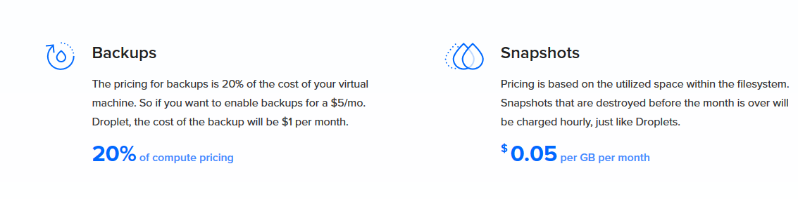

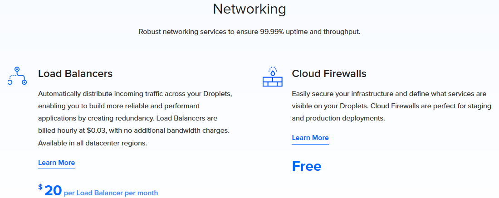

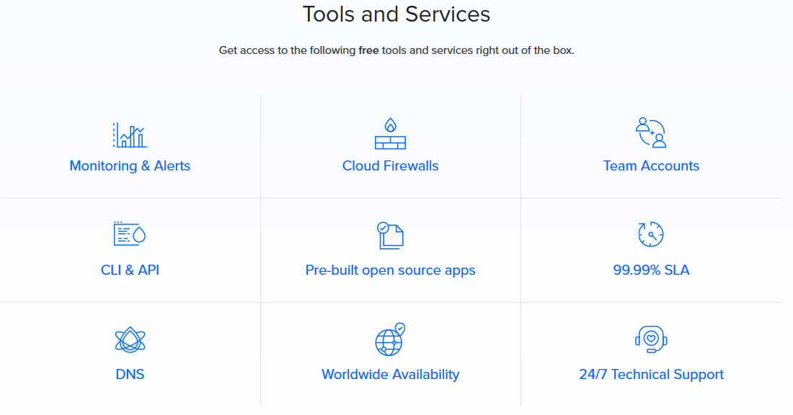

>[Pricing on DigitalOcean (www.digitalocean.com)](https://www.digitalocean.com/pricing/)

## เริ่มใช้งาน

ก่อนอื่นก็คงไม่พ้นการสมัคร account ในการใช้งานก่อน ตัว account นั้นสมัครฟรี ข้างในเสียตังอยู่ดี แต่ถ้าสมัครผ่าน[ลิงค์นี้](https://m.do.co/c/ce13f779b449) ทางระบบจะให้เครดิตไปทดลองใช้เลยฟรีๆ $10

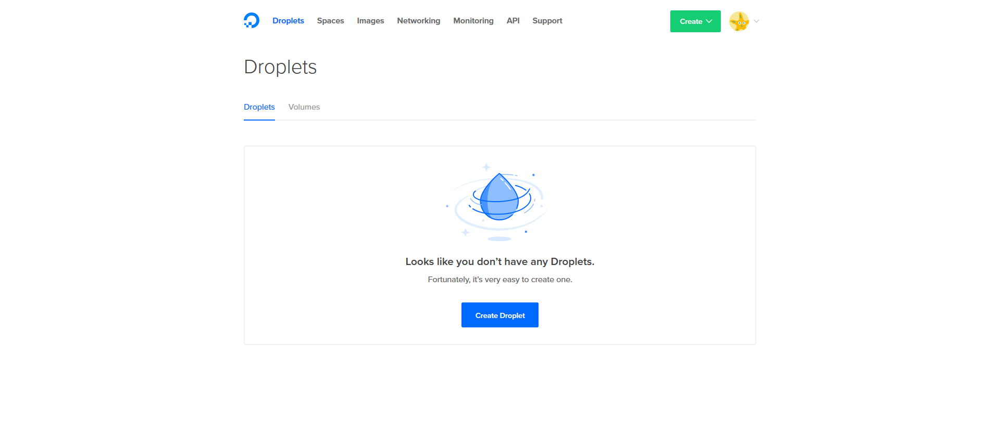

เมื่อคลิกปุ่ม Create Droplet แล้วเราจะพบกับหน้าสร้าง Droplet ของเราโดยสามารถเลือกได้ทั้ง OS, spec ของ Droplet, เพิ่มขนาดด้วย Volume, ตำแหน่ง datacenter รวมทั้งฟีเจอร์เสริมต่างๆเช่น backup, IPv6 และ SSH key

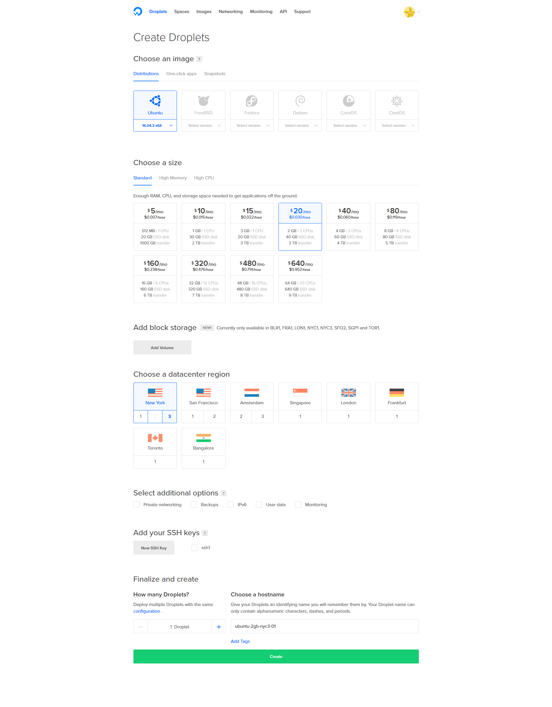

ในส่วนของ One-click apps นั้นก๋็สามารถเลือกได้เช่นกัน ในกรณีที่บางซอฟท์แวร์ใช้เกิน spec ที่มีไว้ให้นั้น ตัวเลือกจะถูกล็อกไว้ทันที เช่น WordPress และ Ghost ที่ใช้พื้นที่ disk เกิน

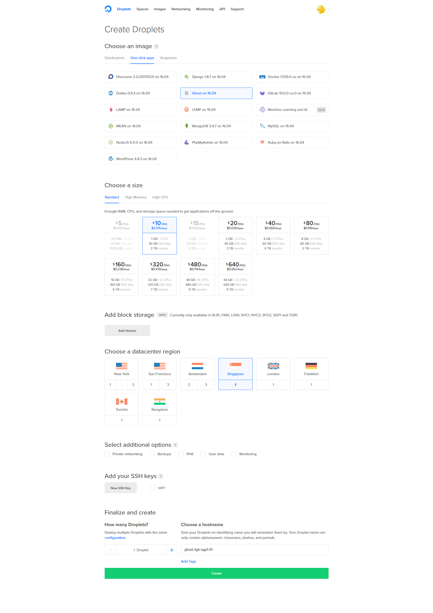

ในที่นี้เราจะมาลองสร้าง Ghost Droplet กัน ข้อดีของ DigitalOcean คือการจ่ายเป็นรายชั่วโมง หากสร้าง Droplet ขึ้นมาเพื่อทดสอบอะไรนิดๆหน่อยๆ ก็จ่ายตามจำนวนชั่วโมงที่ใช้ เมื่อกดปุ่ม Create ไปแล้วก็จะเด้งกลับมาที่หน้า Control Panel หลังจากนั้นไม่นานเราก็จะได้ Droplet ที่เราสร้างพร้อม IP พร้อมอีเมล์ข้อมูลสำหรับ SSH เข้าไปตั้งค่า Droplet

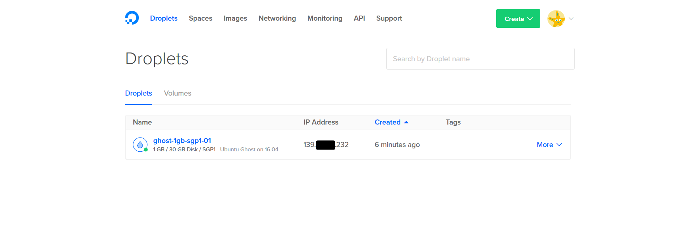

ถ้าคลิกที่ชื่อ Droplet แล้วจะพบกับหน้าข้อมูลต่างๆของ Droplet ของเรา พร้อมให้เราปรับแต่งได้เหมือนเซิร์ฟเวอร์จริงๆ แล้วยังมี remote console ให้ใช้ผ่านเว็บอีกด้วย แต่ยังไงก็แนะนำให้ใช้ SSH client จริงๆดีกว่า โดยทุกครั้งที่เข้า SSH เป็นครั้งแรก ระบบจะบังคับให้เปลี่ยนรหัสผ่านทันทีเพื่อความปลอดภัย

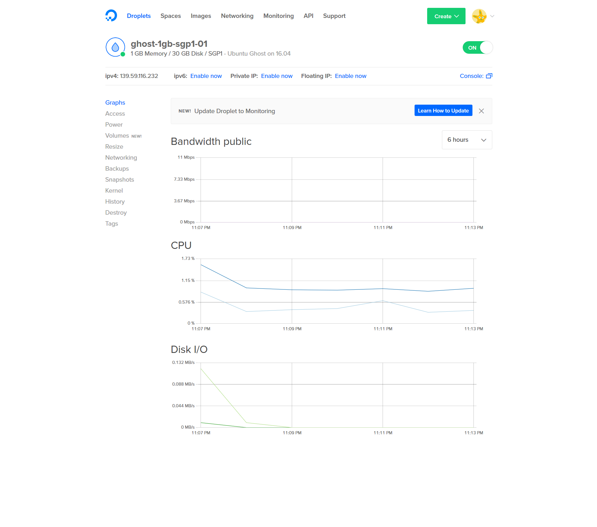

ภายใน SSH console นั้นจะมีลิงค์สำหรับเข้าใช้ Ghost อยู่ สามารถ copy ลิงค์ไปวางใน browser ได้เลย

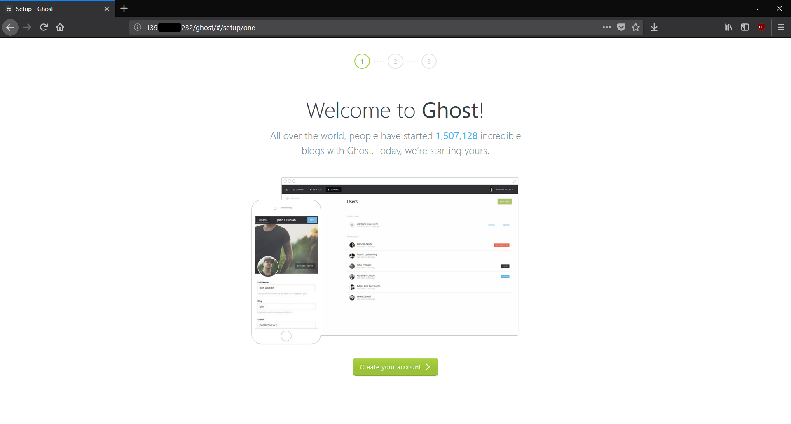

นอกจากนั้นแล้ว ตัว Droplet นั้นยังเป็นเซิร์ฟเวอร์ Ubuntu อย่างเต็มตัว จึงสามารถทำอะไรได้นอกเหนือจากนี้อีก

สำหรับการสร้าง Droplet แบบอื่นๆนั้นจะมีขั้นตอนตั้งค่าที่คล้ายกันทุก OS่ แต่ถ้าหากเป็นพวก One-click apps นั้นอาจมีขั้นตอน Set up เพิ่มขึ้นมาในหน้า front-end เช่น Ghost กับ WordPress ที่มีการตั้งบัญชี admin ของ app แยกออกมาจากบัญชี root ของ Droplet ที่เราใช้ SSH เข้าเซิร์ฟเวอร์ (หรือใครใช้ SSH key ก็เข้าระบบอีกแบบ)

## เพิ่มเติม

### การจ่ายเงิน

DigitalOcean นั้นรองรับการจ่ายเงินออนไลน์ผ่านบัตรเครดิตและบัตรเดบิต รวมถึง ผ่านบัญชี PayPal โดยสามารถเลือกซื้อเครดิตไว้ก่อนได้หรือให้หักจากบัตรเมื่อถึงยอดใช้งาน และยังมีระบบเตือนค่าบริการหากเกินกำหนดที่เราตั้งไว้ผ่านอีเมล์

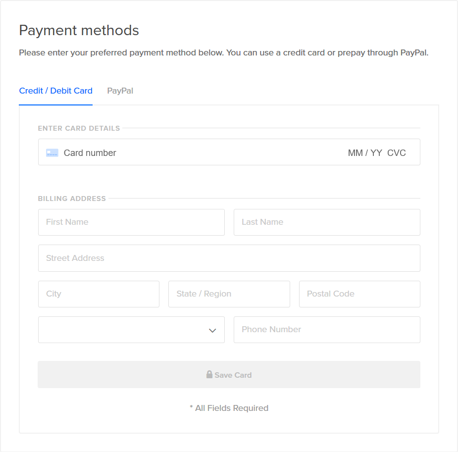

### ระบบ Referral

หรือถ้าอยากชวนคนอื่นให้เข้ามาใช้บริการของ DigitalOcean แบบฟรีๆ ก็สามารถนำ[ลิงค์ referral ของเรา](https://m.do.co/c/ce13f779b449)ไปให้เขาสมัคร และเขาจะได้เครดิตไปทดลองใช้ทันทีถึง $10

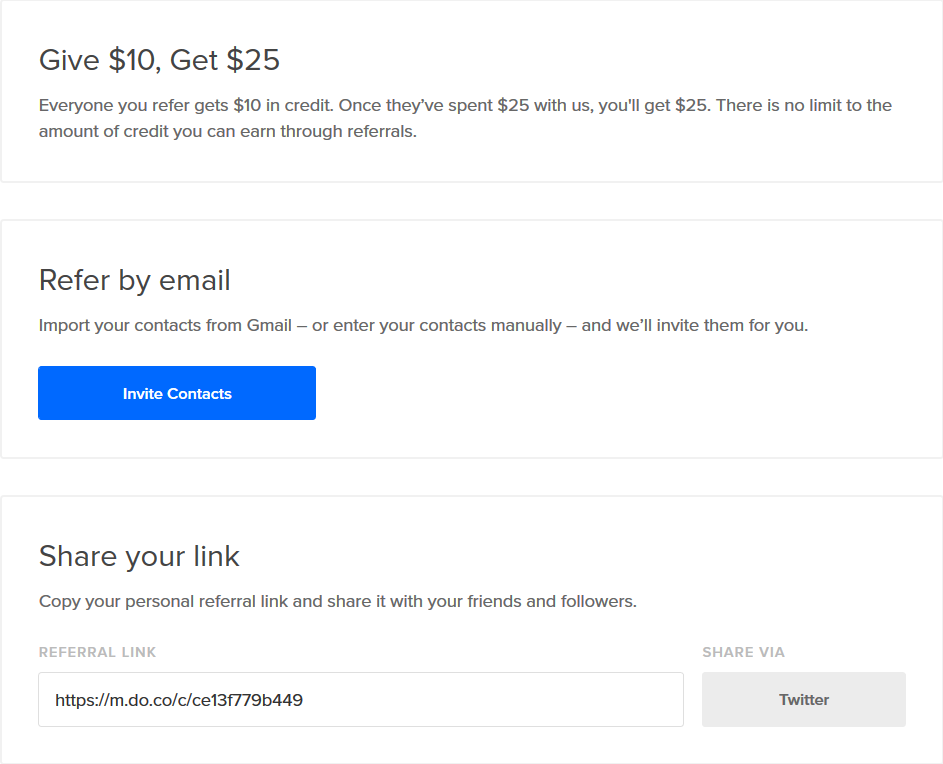

### ความปลอดภัย

เพราะระบบออนไลน์นั้นไม่ปลอดภัย 100% เสมอไป ทาง DigitalOcean ก็มีฟีเจอร์ด้านความปลอดภัยให้ทุกคนได้ใช้เพื่อเสริมความแกร่งด้วย 2-factor authentication และ SSH key สำหรับบัญชีและ Droplet ของเรา

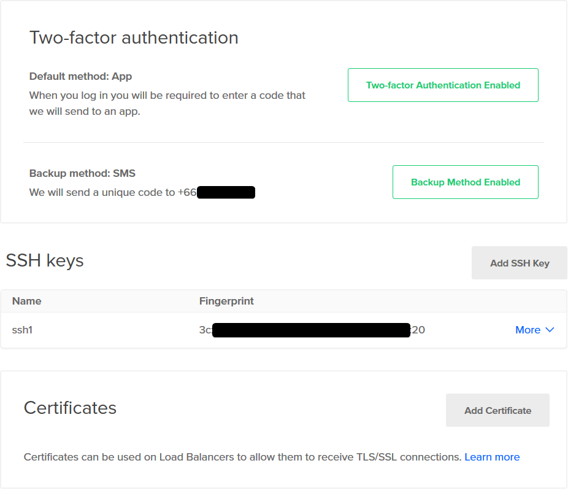

### Community

เพราะ DigitalOcean นั้นถูกใช้โดย developer และ sysadmin จำนวนมาก จึงมักเกิดคำถามในเรื่องระบบขึ้นมา แล้วใช่ว่าทีม support จะตอบได้ทุกเรื่องเสมอไป ทำให้มีส่วนของ community board ขึ้นมาเพื่อให้ทุกคนเข้ามาค้นคว้า หาคำตอบและ tutorial ในการทำระบบบางอย่าง โดยมีส่วนของ tutorial และ Q&A แยกกัน

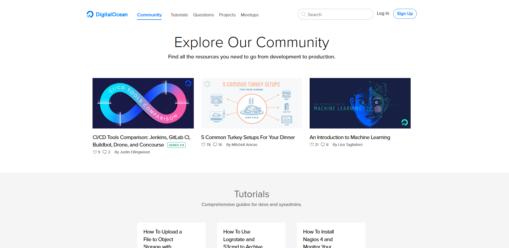

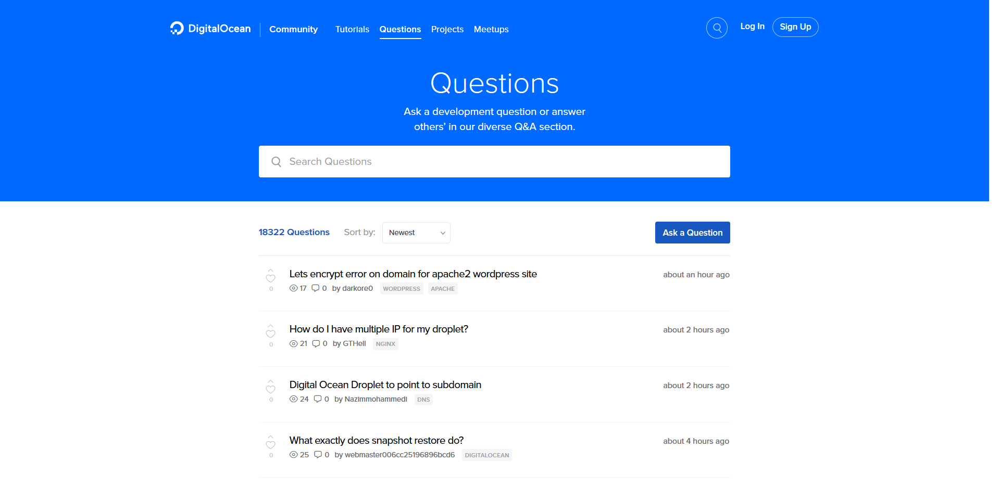

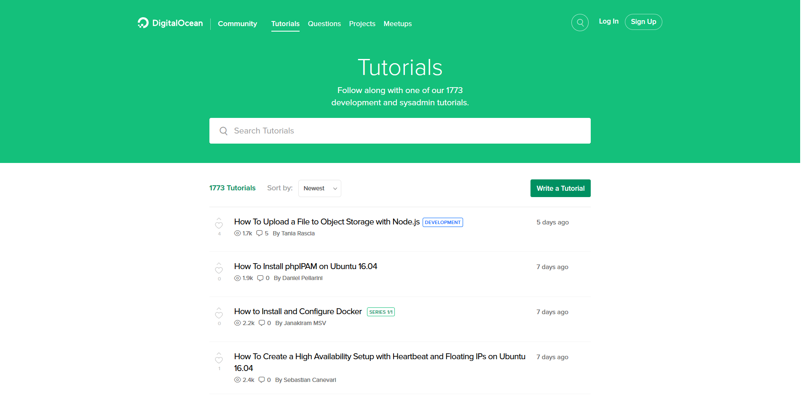

## ทิ้งท้าย

DigitalOcean นั้นสามารถ scale เซิร์ฟเวอร์ตามความต้องการหลายๆแบบของ developer และทีมงานอื่นๆ ได้อย่างง่าย อยากได้เซิร์ฟเวอร์ขนาดเล็กไว้ทดสอบซอฟท์แวร์อะไรนิดๆหน่อยๆ ก็ตั้ง Droplet ขนาดเล็กมาลองแล้ว destroy ได้ทันทีหากมีอะไรผิดพลาดเกิดขึ้นโดยไม่ต้องล้างทั้งระบบแบบเซิร์ฟเวอร์ตัวจริง ถ้าหากมีความต้องการกลุ่มเซิร์ฟเวอร์จำนวนมากมาใช้ในระบบของเราก็สามารถสร้าง Droplet จำนวนมากพร้อม private connection เชื่อมต่อกันเองได้ในไม่กี่อึดใจ จึงถูกเลือกไปใช้โดยกลุ่ม developer และบริษัท IT จำนวนมากทั่วโลก

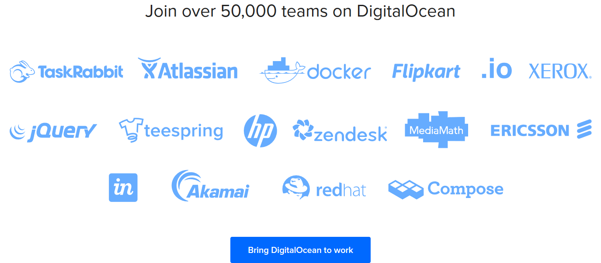
