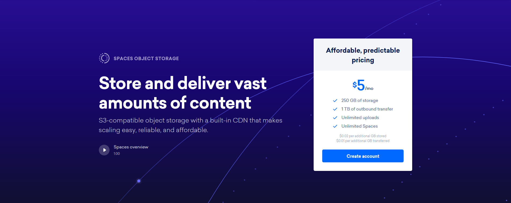
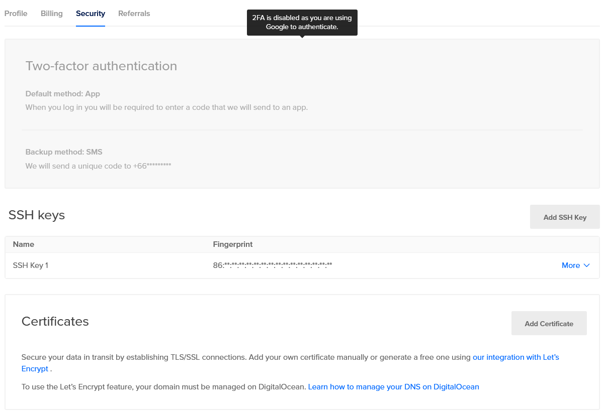

DigitalOcean คือผู้ให้บริการ Cloud server ระดับต้นๆ โดยถูกออกแบบมาเพื่อให้ Developer ใช้งานได้อย่างสะดวกและง่ายดาย ด้วยจุดเด่นในด้านความเร็วในการตั้งเซิร์ฟเวอร์เพียงไม่กี่อึดใจและราคาที่เหมาจ่ายเป็นรายชั่วโมง

## บริการต่างๆ ของ DigitalOcean

### [Droplets](https://www.digitalocean.com/products/droplets/)

Droplets นั้นคือเซิร์ฟเวอร์เสมือนที่สามารถ Deploy ได้ภายในเวลาไม่ถึงนาที โดยมีตัวเลือกให้ค่อนข้างละเอียดในเรื่องของ RAM, CPU และขนาดของ SSD โดยสามารถเปลี่ยนสเปคได้ตามการใช้งานที่แตกต่างกันไป โดยมีให้เลือกหลากหลายแบบ ทั้งแบบทั่วไป และแบบเน้น CPU หรือเน้น RAM

โดย OS ที่สามารถใช้ได้นั้นจะเป็น Linux distro ชื่อดังทั้งหลายให้เลือกใช้ และยังสามารถเพิ่ม image ส่วนตัวขึ้นไปใช้ได้ จึงทำให้มีความยืดหยุ่นในการตั้งเซิร์ฟเวอร์อย่างมาก

นอกจากนี้แล้วยังสามารถสร้าง droplet ที่ติดตั้งชุดซอฟท์แวร์พร้อมใช้ผ่านตัวช่วยเรียกว่า 1-Click Apps ที่สามารถใช้งานได้ทันที\*

> \*ขึ้นอยู่กับซอฟท์แวร์ที่เลือกติดตั้ง โดยส่วนใหญ่แล้วนั้นจะมีขั้นตอนการตั้งค่าครั้งแรกที่เกิดขึ้นหลังการติดตั้งชุดซอฟท์แวร์นั้นๆ สามารถอ่านข้อมูลเพิ่มเติมได้ที่หน้าของชุดซอฟท์แวร์นั้นๆว่าระบบจะติดตั้งอะไรบ้างที่จำเป็นต้องใช้

ถึงแม้ว่า DigitalOcean จะให้บริการเซิร์ฟเวอร์ให้เช่าเป็นหลัก แต่ก็ยังมีบริการอื่นๆ ให้เลือกใช้ตามความต้องการอีกมากมาย เช่น

### [Kubernetes](https://www.digitalocean.com/products/kubernetes/)

ในยุคสมัยแห่ง cloud computing นั้นก็คงไม่พ้นเทรนด์ของ container ซึ่งทาง DigitalOcean นั้นก็มีบริการพิเศษสำหรับการบริหารจัดการ Kubernetes cluster โดยจะใช้ droplet เป็นตัวหลักในการประมวลผล

### [Managed Databases](https://www.digitalocean.com/products/managed-databases/)

สำหรับใครที่ใช้ฐานข้อมูลขนาดใหญ่ก็สามารถใช้บริการ managed database ของ DigitalOcean ซึ่งมาพร้อมกับฟีเจอร์เสริมเช่น backup ฟรีรายวันและระบบป้องกันการล่มแบบอัตโนมัติ

### [Spaces](https://www.digitalocean.com/products/spaces/)

Spaces นั้นคือบริการ Object Storage ให้กับแอปพลิเคชันของเราที่ต้องการพื้นที่ในการเก็บข้อมูลสูง เช่นเก็บรูปภาพ ไฟล์ล็อก หรือคอนเทนต์ต่างๆบนเว็บได้โดยไม่ต้องกลัวว่าพื้นที่ใน Droplet จะเต็ม เพราะหากใช้เกินทางระบบจะคิดเพิ่มให้อัตโนมัติ และข้อดีอีกอย่างก็คือการที่ไม่จำเป็นต้องเชื่อมกับ Droplet ของตัวเอง จึงทำให้มีความยืดหยุ่นในเรื่องของแอปพลิเคชันที่เราจะใช้กับ Spaces ด้วย

- - -

## เริ่มใช้งาน

ก่อนอื่นก็คงไม่พ้นการสมัคร account ในการใช้งานก่อน ตัว account นั้นสมัครฟรี ข้างในเสียตังอยู่ดี แต่ถ้าสมัครผ่าน[**ลิงค์นี้**](https://m.do.co/c/ce13f779b449) ทางระบบจะให้เครดิตไปทดลองใช้เลยฟรีๆ **$100** เรียกได้ว่าใช้ได้ยาวๆ ลองทำอะไรได้หลายอย่าง

> _จำนวนเครดิตฟรีนั้นสามารถเปลี่ยนแปลงได้ตลอด ตอนแรกที่เขียนบทความนี้ (2017) ถ้าสมัครผ่านลิงค์จะได้เครดิตแค่ $10 แต่ตอนนี้ (2019) ก็ได้เพิ่มเครดิตขึ้นมาถึง $100 เอาไว้ทดลองระบบต่างๆได้ตามใจ_

เมื่อคลิกปุ่ม Create Droplet แล้วเราจะพบกับหน้าสร้าง Droplet ของเราโดยสามารถเลือกได้ทั้ง OS, spec ของ Droplet, เพิ่มขนาดด้วย Volume, ตำแหน่งของ datacenter รวมทั้งฟีเจอร์เสริมต่างๆเช่น 1-Click app, backup, IPv6 และ SSH key ที่เราบันทึกเก็บไว้ใช้ในการล็อกอินเข้า Droplet แทนรหัสผ่าน

ในที่นี้เราจะมาลองสร้าง Droplet [Ghost](https://ghost.org/) กัน ข้อดีของ DigitalOcean คือการจ่ายเป็นรายชั่วโมง หากสร้าง Droplet ขึ้นมาเพื่อทดสอบอะไรนิดๆหน่อยๆ ก็จ่ายตามจำนวนชั่วโมงที่ใช้ ถ้าเปิดใช้งานเกิน 672 ชั่วโมง (28 วัน * 24 ชั่วโมง) ก็จะปรับราคาไปเป็นแบบรายเดือนแทน

เมื่อกดปุ่ม Create ไปแล้วก็จะเด้งกลับมาที่หน้า Control Panel หลังจากนั้นไม่นานเราก็จะได้ Droplet ที่เราสร้างพร้อม IP พร้อมอีเมล์ข้อมูลสำหรับ SSH เข้าไปตั้งค่า Droplet

ถ้าคลิกที่ชื่อ Droplet แล้วจะพบกับหน้าข้อมูลต่างๆของ Droplet ของเรา พร้อมให้เราปรับแต่งได้เหมือนเซิร์ฟเวอร์จริงๆ แล้วยังมี remote console ให้ใช้ผ่านเว็บอีกด้วย แต่ยังไงก็แนะนำให้ใช้ SSH client จริงๆดีกว่า โดยทุกครั้งที่เข้า SSH เป็นครั้งแรก ระบบจะบังคับให้เปลี่ยนรหัสผ่านทันทีเพื่อความปลอดภัย

ภายใน SSH console นั้นจะมีลิงค์สำหรับเข้าใช้ Ghost อยู่ สามารถ copy ลิงค์ไปวางใน browser ได้เลย

  

ขั้นตอนทั้งหมดที่ทำไปนั้น ใช้เวลารวมกันไม่ถึง 5 นาที ก็มีบล็อก Ghost เป็นของตัวเองแล้ว
นอกจากนั้น ตัว Droplet นั้นยังเป็นเซิร์ฟเวอร์ Ubuntu อย่างเต็มตัว จึงสามารถทำอะไรได้นอกเหนือจากนี้อีก 

สำหรับการสร้าง Droplet แบบอื่นๆนั้นจะมีขั้นตอนตั้งค่าที่คล้ายกันทุก OS แต่ถ้าหากเป็นพวก 1-Click apps นั้นอาจมีขั้นตอน Set up เพิ่มขึ้นมาในหน้า front-end เช่น Ghost กับ WordPress ที่มีการตั้งบัญชี admin ของ app แยกออกมาจากบัญชี root ของ Droplet ที่เราใช้ SSH เข้าเซิร์ฟเวอร์ (หรือใครใช้ SSH key ก็เข้าระบบอีกแบบ)

## เพิ่มเติม

### การจ่ายเงิน

DigitalOcean นั้นรองรับการจ่ายเงินออนไลน์ผ่านบัตรเครดิตและบัตรเดบิต รวมถึง ผ่านบัญชี PayPal โดยสามารถเลือกซื้อเครดิตไว้ก่อนได้หรือให้หักจากบัตรเมื่อถึงยอดใช้งาน และยังมีระบบเตือนค่าบริการหากเกินกำหนดที่เราตั้งไว้ผ่านอีเมล

### ระบบ Referral

หรือถ้าอยากชวนคนอื่นให้เข้ามาใช้บริการของ DigitalOcean แบบฟรีๆ ก็สามารถนำ[**ลิงค์ referral ของเรา**](https://m.do.co/c/ce13f779b449)ไปให้เขาสมัคร และเขาจะได้เครดิตไปทดลองใช้ทันทีถึง $100 หากเขาติดใจขึ้นมาแล้วใช้บริการต่อจนครบ $25 เราก็จะได้โบนัสเข้าบัญชีเรา $25 ในรอบเดือนถัดไป

> _ย้ำอีกครั้งว่า จำนวนเครดิตฟรีนั้นสามารถเปลี่ยนแปลงได้ตลอด_

### ความปลอดภัย

เพราะระบบออนไลน์นั้นไม่ปลอดภัย 100% เสมอไป ทาง DigitalOcean ก็มีฟีเจอร์ด้านความปลอดภัยให้ทุกคนได้ใช้เพื่อเสริมความแกร่งด้วย Two-factor authentication และ SSH key สำหรับบัญชีและ Droplet ของเรา

### [Community](https://www.digitalocean.com/community)

เพราะ DigitalOcean นั้นถูกใช้โดย developer และ sysadmin จำนวนมาก จึงมักเกิดคำถามในเรื่องระบบขึ้นมา แล้วใช่ว่าทีม support จะตอบได้ทุกเรื่องเสมอไป ทำให้มีส่วนของ community board ขึ้นมาเพื่อให้ทุกคนเข้ามาค้นคว้า หาคำตอบและ tutorial ในการทำระบบบางอย่าง โดยมีส่วนของ tutorial และ Q&A แยกกัน

## ปิดท้าย

DigitalOcean นั้นสามารถ scale เซิร์ฟเวอร์ตามความต้องการหลายๆแบบของ developer และทีมงานอื่นๆ ได้อย่างง่าย อยากได้เซิร์ฟเวอร์ขนาดเล็กไว้ทดสอบซอฟท์แวร์อะไรนิดๆหน่อยๆ ก็ตั้ง Droplet ขนาดเล็กมาลองแล้ว destroy ได้ทันทีหากมีอะไรผิดพลาดเกิดขึ้นโดยไม่ต้องล้างทั้งระบบแบบเซิร์ฟเวอร์ตัวจริง ถ้าหากมีความต้องการกลุ่มเซิร์ฟเวอร์จำนวนมากมาใช้ในระบบของเราก็สามารถสร้าง Droplet จำนวนมากพร้อม private connection เชื่อมต่อกันเองได้ในไม่กี่อึดใจ จึงถูกเลือกไปใช้โดยกลุ่ม developer และบริษัท IT จำนวนมากทั่วโลก
